# UML Diagrams — RUBIS Car Wash Management System
> Paste each code block into [https://www.plantuml.com/plantuml/uml/](https://www.plantuml.com/plantuml/uml/) to render the diagram.

---

## 1. Use Case Diagram

```plantuml
@startuml
left to right direction
scale 0.75
skinparam actorStyle default
skinparam packageStyle rectangle
skinparam defaultFontSize 10
skinparam padding 3
skinparam nodesep 18
skinparam ranksep 25

title RUBIS Car Wash Management System — Use Case Diagram

actor "Guest\n(Walk-in)" as Guest
actor "Customer\n(Registered)" as Customer
actor "Staff\n(Washer)" as Staff
actor "Manager" as Manager
actor "Admin\n(System Admin)" as Admin

rectangle "RUBIS Car Wash System" {

  ' Guest use cases
  usecase "Book as Guest\n(No Login)" as UC_GuestBook
  usecase "View Booking\nConfirmation" as UC_GuestConfirm
  usecase "Register Guest\nAccount" as UC_GuestRegister

  ' Customer use cases
  usecase "Register Account" as UC_Register
  usecase "Login / Logout" as UC_Login
  usecase "Create Booking" as UC_CreateBooking
  usecase "View My Bookings" as UC_ViewBookings
  usecase "Cancel Booking" as UC_CancelBooking
  usecase "Edit Booking" as UC_EditBooking
  usecase "Make Payment\n(MTN/Airtel/Cash)" as UC_Pay
  usecase "View Payment History" as UC_PayHistory
  usecase "Request Account\nDeletion" as UC_DeleteReq

  ' Staff use cases
  usecase "View Queue" as UC_Queue
  usecase "Update Booking\nStatus" as UC_UpdateStatus
  usecase "Mark Booking\nIn Progress" as UC_StartWash
  usecase "Mark Booking\nCompleted" as UC_CompleteWash

  ' Manager use cases
  usecase "Manage Employees" as UC_ManageEmp
  usecase "Assign Staff\nto Booking" as UC_Assign
  usecase "Unassign Staff" as UC_Unassign
  usecase "View Reports &\nAnalytics" as UC_Reports
  usecase "Manage Services" as UC_ManageServices
  usecase "View All Bookings" as UC_AllBookings
  usecase "View All Payments" as UC_AllPayments
  usecase "Approve Refund" as UC_Refund

  ' Admin use cases
  usecase "Manage Users\n(Roles)" as UC_ManageUsers
  usecase "Approve Customer\nDeletion" as UC_ApproveDel
  usecase "Export Reports\n(Excel / PDF)" as UC_Export
  usecase "View Dashboard\nKPIs" as UC_Dashboard
}

' Guest relationships
Guest --> UC_GuestBook
Guest --> UC_GuestConfirm
Guest --> UC_GuestRegister

' Customer relationships
Customer --> UC_Register
Customer --> UC_Login
Customer --> UC_CreateBooking
Customer --> UC_ViewBookings
Customer --> UC_CancelBooking
Customer --> UC_EditBooking
Customer --> UC_Pay
Customer --> UC_PayHistory
Customer --> UC_DeleteReq

' Staff relationships
Staff --> UC_Login
Staff --> UC_Queue
Staff --> UC_UpdateStatus
Staff --> UC_StartWash
Staff --> UC_CompleteWash

' Manager relationships
Manager --> UC_Login
Manager --> UC_ManageEmp
Manager --> UC_Assign
Manager --> UC_Unassign
Manager --> UC_Reports
Manager --> UC_ManageServices
Manager --> UC_AllBookings
Manager --> UC_AllPayments
Manager --> UC_Refund
Manager --> UC_Dashboard

' Admin relationships
Admin --> UC_Login
Admin --> UC_ManageUsers
Admin --> UC_ApproveDel 
Admin --> UC_Export
Admin --> UC_Dashboard
Admin --> UC_ManageEmp
Admin --> UC_AllBookings
Admin --> UC_AllPayments
Admin --> UC_Reports
Admin --> UC_Assign
Admin --> UC_Unassign

@enduml
```

---

## 2. Class Diagram (Domain Model)

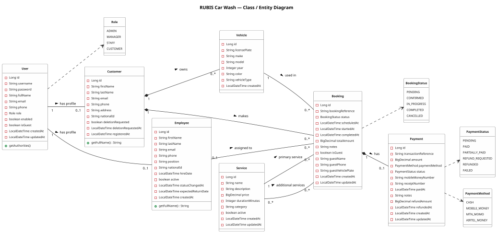

---

## 3. Entity Relationship Diagram (Database Structure)

```plantuml
@startuml
scale 0.62
left to right direction
skinparam defaultFontSize 9
skinparam defaultFontColor #000000
skinparam arrowColor #222222
skinparam padding 3
skinparam nodesep 30
skinparam ranksep 40
skinparam entity {
  BackgroundColor #FFFFFF
  BorderColor #333333
  FontColor #000000
  FontSize 10
  FontStyle bold
  AttributeFontColor #000000
  AttributeFontSize 9
}

title RUBIS Car Wash — Entity Relationship Diagram

entity "users" as users {
  * id : BIGINT <<PK>>
  --
  * username : VARCHAR UNIQUE
  * password : VARCHAR
  * full_name : VARCHAR
  * email : VARCHAR UNIQUE
  phone : VARCHAR
  * role : ENUM(ADMIN,MANAGER,STAFF,CUSTOMER)
  * enabled : BOOLEAN
  * is_guest : BOOLEAN DEFAULT false
  created_at : TIMESTAMP
  updated_at : TIMESTAMP
}

entity "customers" as customers {
  * id : BIGINT <<PK>>
  --
  user_id : BIGINT <<FK>>
  * first_name : VARCHAR
  * last_name : VARCHAR
  email : VARCHAR UNIQUE
  phone : VARCHAR
  address : VARCHAR
  national_id : VARCHAR
  deletion_requested : BOOLEAN DEFAULT false
  deletion_requested_at : TIMESTAMP
  registered_at : TIMESTAMP
}

entity "employees" as employees {
  * id : BIGINT <<PK>>
  --
  user_id : BIGINT <<FK>>
  * first_name : VARCHAR
  * last_name : VARCHAR
  email : VARCHAR UNIQUE
  phone : VARCHAR
  position : VARCHAR
  national_id : VARCHAR
  hire_date : TIMESTAMP
  active : BOOLEAN DEFAULT true
  status_changed_at : TIMESTAMP
  expected_return_date : TIMESTAMP
  created_at : TIMESTAMP
}

entity "vehicles" as vehicles {
  * id : BIGINT <<PK>>
  --
  * customer_id : BIGINT <<FK>>
  * license_plate : VARCHAR UNIQUE
  * make : VARCHAR
  * model : VARCHAR
  year : INTEGER
  color : VARCHAR
  vehicle_type : VARCHAR
  created_at : TIMESTAMP
}

entity "services" as services {
  * id : BIGINT <<PK>>
  --
  * name : VARCHAR UNIQUE
  description : TEXT
  * price : DECIMAL(10,2)
  duration_minutes : INTEGER
  category : VARCHAR
  active : BOOLEAN DEFAULT true
  created_at : TIMESTAMP
  updated_at : TIMESTAMP
}

entity "bookings" as bookings {
  * id : BIGINT <<PK>>
  --
  * booking_reference : VARCHAR UNIQUE
  customer_id : BIGINT <<FK>>
  vehicle_id : BIGINT <<FK>>
  * service_id : BIGINT <<FK>>
  assigned_employee_id : BIGINT <<FK>>
  * status : ENUM(PENDING,CONFIRMED,IN_PROGRESS,COMPLETED,CANCELLED)
  * scheduled_at : TIMESTAMP
  started_at : TIMESTAMP
  completed_at : TIMESTAMP
  * total_amount : DECIMAL(10,2)
  notes : VARCHAR(500)
  is_guest : BOOLEAN DEFAULT false
  guest_name : VARCHAR(200)
  guest_phone : VARCHAR(30)
  guest_vehicle_plate : VARCHAR(50)
  created_at : TIMESTAMP
  updated_at : TIMESTAMP
}

entity "booking_additional_services" as bas {
  * booking_id : BIGINT <<FK>>
  * service_id  : BIGINT <<FK>>
}

entity "payments" as payments {
  * id : BIGINT <<PK>>
  --
  * booking_id : BIGINT <<FK>> UNIQUE
  * transaction_reference : VARCHAR UNIQUE
  * amount : DECIMAL(10,2)
  * payment_method : ENUM(CASH,MOBILE_MONEY,MTN_MOMO,AIRTEL_MONEY,CARD,BANK_TRANSFER)
  * status : ENUM(PENDING,PAID,PARTIALLY_PAID,REFUND_REQUESTED,REFUNDED,FAILED)
  mobile_money_number : VARCHAR
  receipt_number : VARCHAR
  paid_at : TIMESTAMP
  notes : VARCHAR(500)
  refund_amount : DECIMAL(10,2)
  refunded_at : TIMESTAMP
  created_at : TIMESTAMP
  updated_at : TIMESTAMP
}

' FK Relationships
users ||--o| customers : "user_id"
users ||--o| employees : "user_id"
customers ||--o{ vehicles : "customer_id"
customers ||--o{ bookings : "customer_id"
vehicles ||--o{ bookings : "vehicle_id"
services ||--o{ bookings : "service_id"
employees ||--o{ bookings : "assigned_employee_id"
bookings ||--o{ bas : "booking_id"
services ||--o{ bas : "service_id"
bookings ||--o| payments : "booking_id"

@enduml
```

---

## 4. Sequence Diagram — Guest Booking Flow

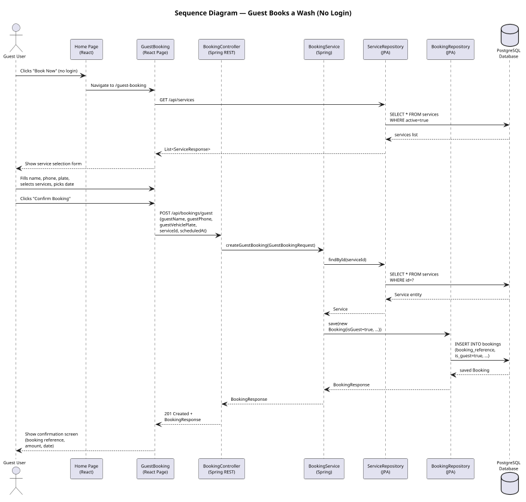

---

## 5. Sequence Diagram — Customer Login & Create Booking

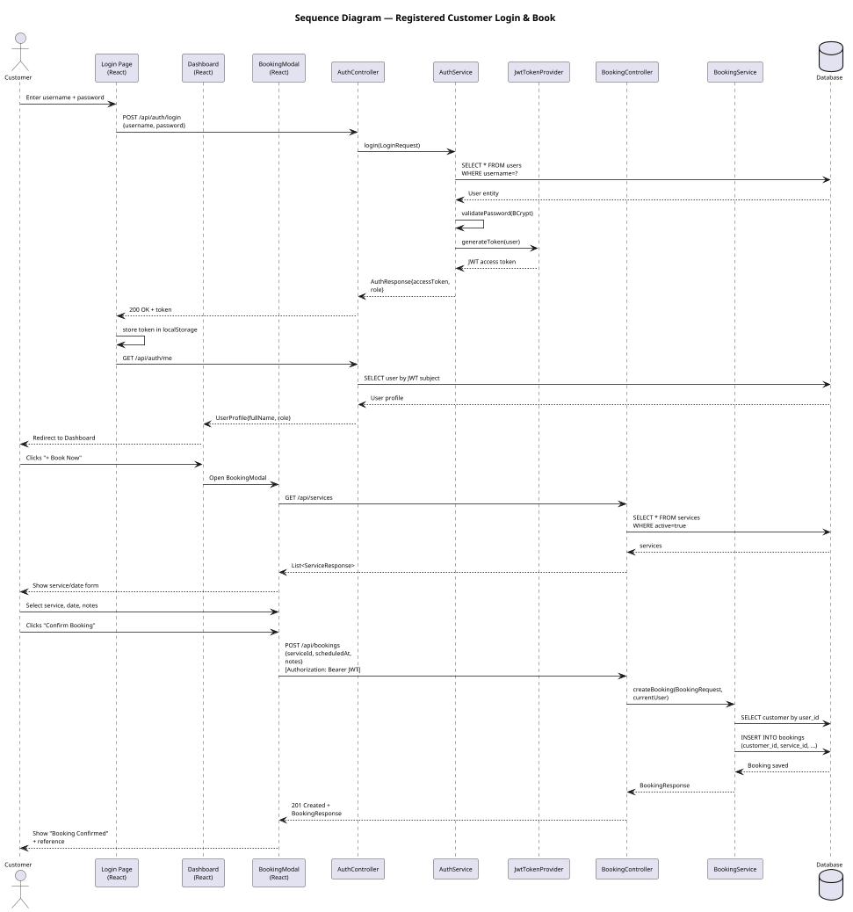

---

## 6. Sequence Diagram — Admin Assigns Staff to Booking

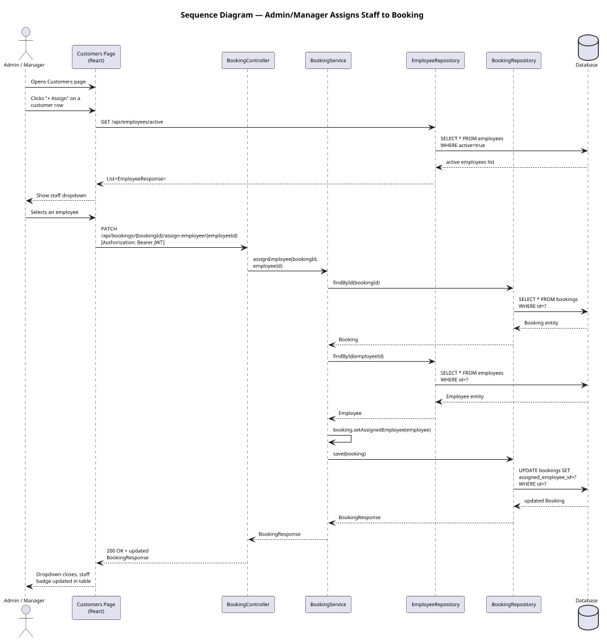

---

## 7. Sequence Diagram — Payment Flow (Mobile Money)

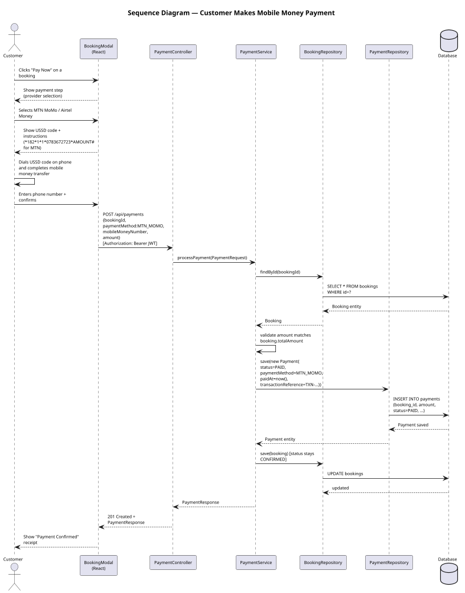

---

## 8. Activity Diagram — Booking Lifecycle

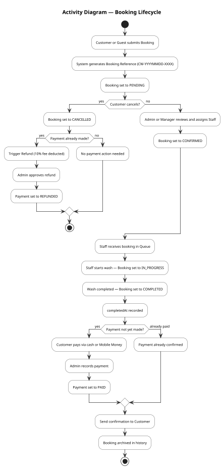

---

## 9. Activity Diagram — User Registration & Login

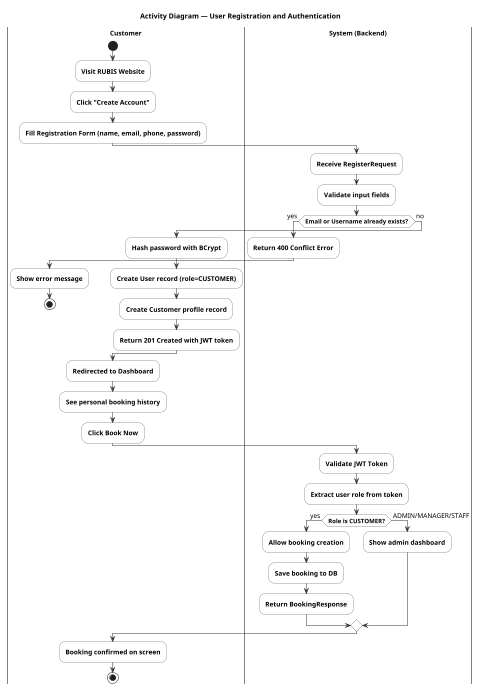

---

## 10. Activity Diagram — Admin Dashboard Operations

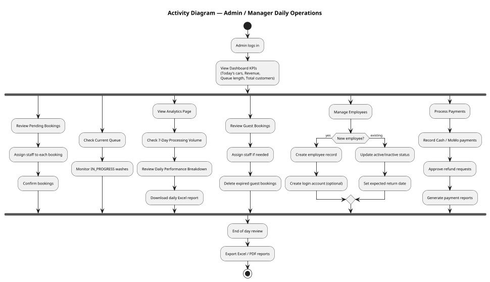

---

## 11. Component Diagram — System Architecture

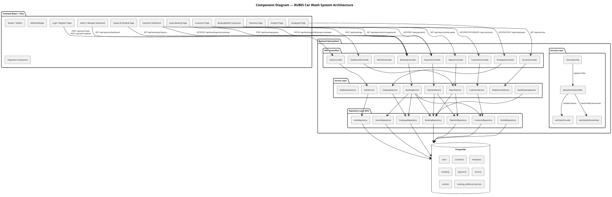

---

## 12. State Machine Diagram — Booking Status Transitions

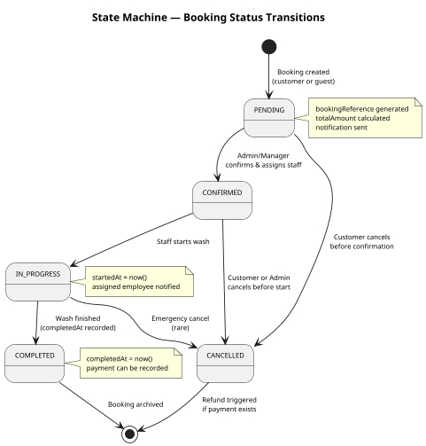

---

## 13. State Machine Diagram — Payment Status Transitions

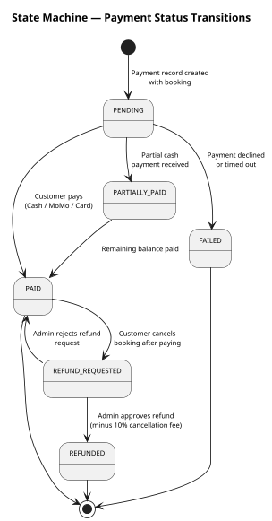

---

## 14. Deployment Diagram

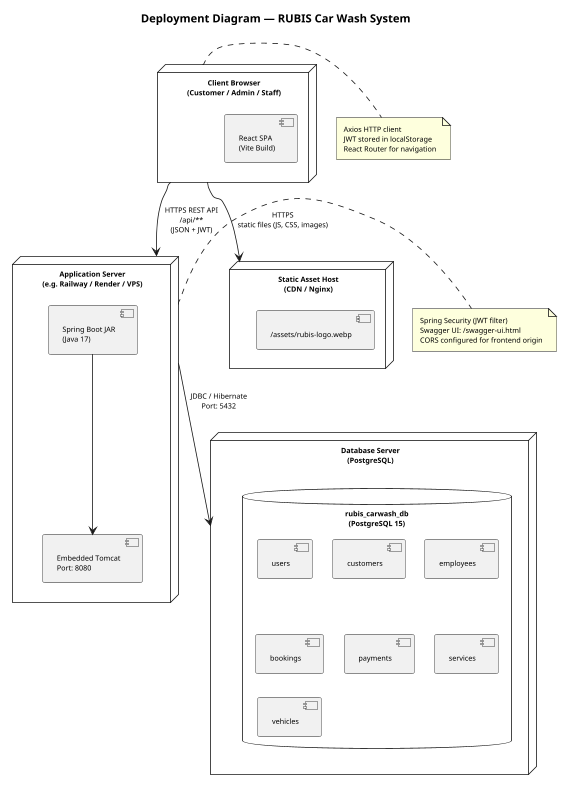

---

## 15. Sequence Diagram — Staff Updates Booking Status (Queue)

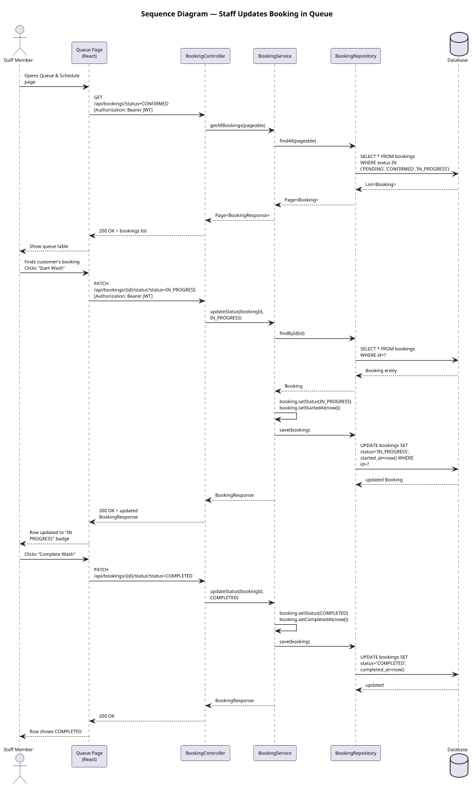

---

## 16. Figure 1 — Traditional Car Wash Process (As-Is Flow)

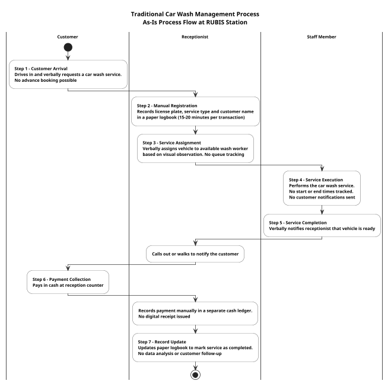

---

## 18. System Architecture Design (Figure 7 — Layered View)

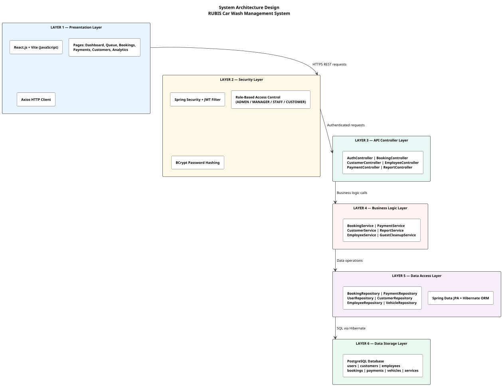

---

*Generated for RUBIS Car Wash Management System — AUCA Final Year Project*
*All diagrams reflect the actual implementation: Spring Boot backend + React/Vite frontend + PostgreSQL.*
